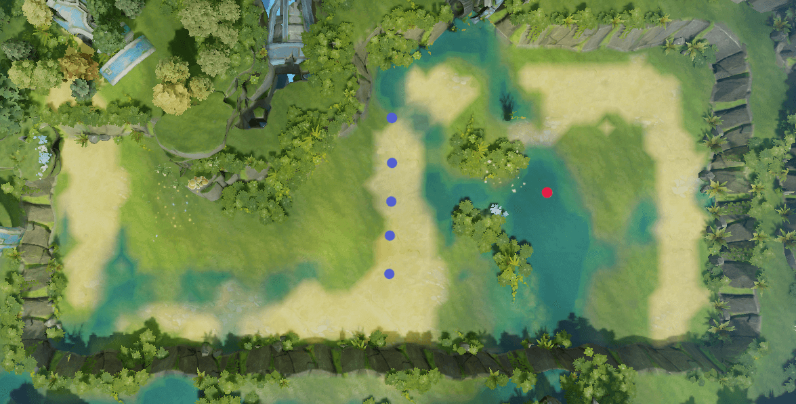
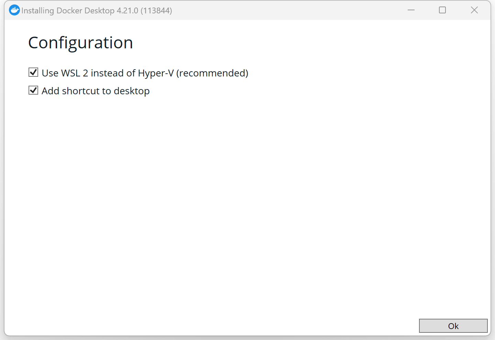
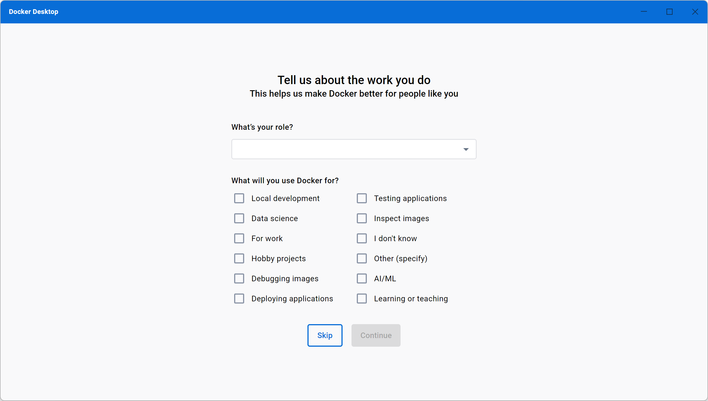
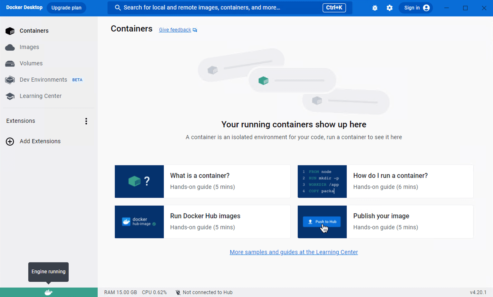
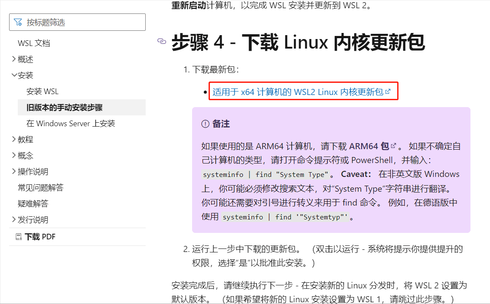
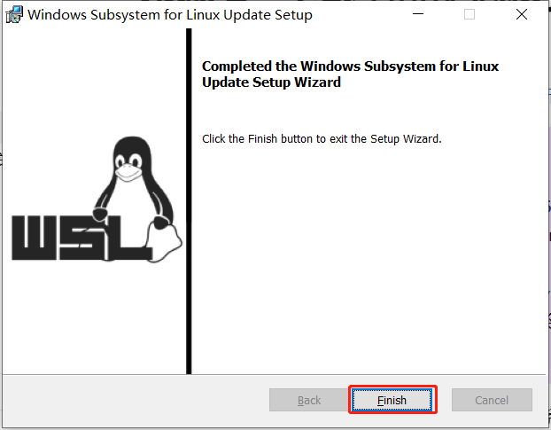
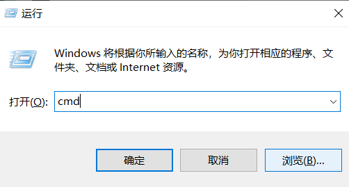
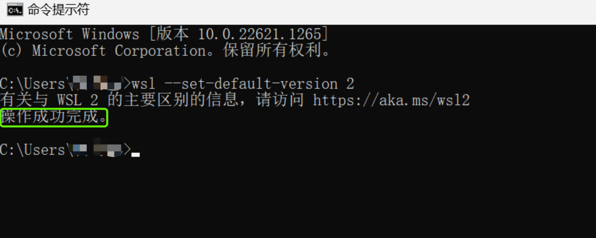
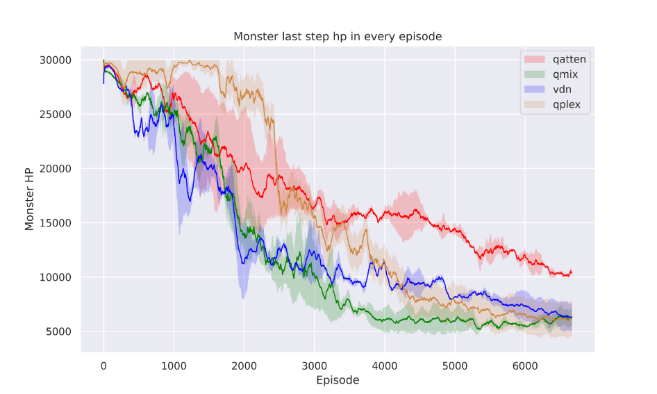

# Introduction

## Preface

Tencent Multi-Agent Mini Environment is an open environment built based on Honor of Kings, which allows researchers to develop and verify multi-agent algorithms using only local computing power.

In the Tencent Multi-Agent Mini Environment, you need to train multiple heroes to fight against wild monsters through algorithms. At the end of the task, the remaining health of the wild monsters will be used as the evaluation metric. In the development guide, we have provided examples of how to integrate four algorithms, VDN, QMIX, QATTEN, and QPLEX, into the environment, and showed some experimental results. Finally, example code for VDN is provided in the code package.

---

## Environment Introduction

### Map
The Honor of Kings Multi-Agent Mini Environment contains agent heroes and wild monsters. The distribution of agent heroes and wild monsters is shown in the figure below, where blue dots represent agent heroes and red dots represent wild monsters. At the beginning of the task, agent heroes and wild monsters will be automatically generated at the designated positions.


### Heroes
| Name | ID | Health | Normal Attack Range | Skill Type 1 | Skill Type 2 | Skill Type 3 |
| :--: | --: | :----: | :------------: | :--------: | :--------: | :--------: |
| **Zhuang Zhou** | 11301 | 7738 | 2800 | Directional Skill | Directional Skill | Targeted Skill (Self-Released) |
| **Di Renjie** | 13301 | 5706 | 8000 | Directional Skill | Directional Skill | Directional Skill |
| **Diao Chan** | 14101 | 5609 | 6000 | Directional Skill | Directional Skill | Targeted Skill (Self-Released) |
| **Sun Wukong** | 16701 | 7843 | 3000 | Targeted Skill (Self-Released) | Directional Skill | Targeted Skill (Self-Released) |
| **Cao Cao** | 12801 | 8185 | 2800 | Directional Skill | Directional Skill | Targeted Skill (Self-Released) |
### Wild Monsters
<table>
  <tr>
    <th>ID</th>
    <td>12202</td>
  </tr>
  <tr>
    <th>Health</th>
    <td>30000</td>
  </tr>
</table>

[Here](https://kaiwu-assets-1258344700.file.myqcloud.com/fe-assets/kaiwu-doc/open-competition-2024/multiagent/mini-hok-demo.mp4) is a video showing different monsters.

---

## Environment Usage

### Installation Requirements
> If using a Linux system, you can ignore the installation requirements and proceed directly to the next step

1. Windows 10/11
2. Python 3.8 or higher
3. Docker. If Docker is not installed on your computer, please follow the [guide](#docker) to complete the installation.

### Apply for License
Please fill out the [Honor of Kings Multi-Agent Minitask Environment License Application Form](https://docs.qq.com/form/page/DVGR3Vk9Jb29lRW9H).

After receiving your application information, we will review it as soon as possible. Once approved, you will receive the license file via the email address provided in the application form.

### Gamecore Installation
1. Start Docker and enter the following commands in the command line:
```shell   
  # Log in to the image repository
  docker login kaiwu.tencentcloudcr.com --username 'tcr$multiagent_public' --password 7GdgM4GIHRICcJf2vAEEIs6QPm9mdm1p
  # Pull the Docker image
  docker pull kaiwu.tencentcloudcr.com/multiagent_public/gamecore:20240513
  # Check the image ID
  docker images
  # Enter the development container, replace IMAGEID with the ID of the image
  docker run -it --rm --name "Env_Name" IMAGEID /bin/bash
  # Query the GameCore container IP address
  ifconfig
```
2. Please copy the `license.dat` file ([file obtained in the license application step](#apply-for-license)) to the `/sgame/` path in the successfully started Docker container.

### Sample Code Installation
1. Start Docker and enter the following commands in the command line:
```shell   
  # Pull the Docker image
  docker pull kaiwu.tencentcloudcr.com/multiagent_public/ai_demo:20240607
  # Enter the development container, replace IMAGEID with the ID of the image
  docker run -it --name "Demo_Name" IMAGEID /bin/bash
  # Clone the github code
  git clone https://github.com/tencent-ailab/mini-hok.git
```
2. Code placement directory: `/home/ubuntu/mini-hok`

### Environment Startup

#### Gamecore Communication Configuration
Before starting the environment, please configure the IP in the sample code configuration file.

Configuration file directory: `./src/envs/hok/hok_game/conf/gamecore_conf.json`

Query the GameCore container IP address and modify the endpoint field in the sample code container's configuration file to **IP address**: 3030.

```shell 
# Open the configuration file
vim ./src/envs/hok/hok_game/conf/gamecore_conf.json
```
```shell
# Configuration file content 
{
    "battlesrv_port": 5555,
    "endpoint": "127.0.0.2:3030",
    "ugc_project_id": 400,
    "level_name": "PVE_1_1",
    "retry_times": 10,
    "retry_sleep_seconds": 1
}
```

#### Start Training
1. Start the GameCore environment. After entering the Docker container, the following command will be automatically executed in the sgame directory:
```shell
./ugc_game_core_server
# After successful startup, the output will be: UGC GameCore Server started. listen port: 3030
```
2. Start the sample code
```shell
cd /home/ubuntu/mini-hok
python3 src/main.py --config="vdn" --env-config="hok" with "env_args.map_name=hok"
# Where the --config parameter is followed by the corresponding algorithm, currently supporting the VDN algorithm
```

#### Model Saving
1. The model during training will be saved to the path ./results/models


#### Evaluation
1. Set the value of checkpoint_path: in the file ./src/config/default.yaml to the path where the model to be loaded is located

2. Execute
```shell
python3 src/main.py --config="vdn" --env-config="hok" with "env_args.map_name=hok"
# Where the --config parameter is followed by the corresponding algorithm, currently supporting the VDN algorithm
```

# Tools Install

## Docker

Below, we will introduce how to install and use Docker on a Windows system. For more information about Docker, please refer to the [Docker official documentation](https://docs.docker.com/).

**1. Download the installation package**

Official download link: https://www.docker.com/get-started/

**2. Install**

2.1 Open the downloaded installation package and install with the default options checked.



2.2 After the installation is complete, open the Docker Desktop client on the desktop. The first time you run it, you need to click [Accept] to agree to the agreement, then click [Skip] to skip the Docker survey, and then you can start running.




2.3 Open Docker and wait for a while, you can see in the lower left corner that the Docker status is running, indicating that Docker has started successfully.

 alt="docker_running" width="50%"

**3. Update WSL 2 Kernel**

If you see the prompt below after running Docker for the first time, you need to update the WSL 2 kernel. Please follow the steps below

 

3.1 Visit the website prompted in the pop-up window (for the Chinese page, you can [click here to view](https://docs.microsoft.com/zh-cn/windows/wsl/install-manual#step-4---download-the-linux-kernel-update-package)), find step 4 on the opened page, and download the installation package shown below.
  

3.2 After the download is complete, run the WSL installation package.
  
  

3.3 After the installation is complete, click Finish.
  

3.4 Open the Windows system terminal. You can press the `Windows key + R` combination to open the Run window, enter `cmd` in the Run window and press Enter, and the Windows system terminal will open. (Alternatively, you can search for "Command Prompt" in the search box at the bottom left corner of your computer, and then click the search result to enter the terminal.)



3.5 Set WSL 2 as the default version. Copy the command below, then paste the copied code into the terminal and press Enter. At this point, you will see a message in the terminal indicating that the operation was successful.

```powershell
wsl --set-default-version 2
```



3.6 Finally, perform a WSL update. Similarly, enter the command below in the terminal and press Enter to complete the operation. (**Note: This operation must be performed on Windows 11 systems**)

```powershell
wsl --update
```

For more information about WSL 2, please refer to the [Microsoft official documentation](https://docs.microsoft.com/zh-cn/windows/wsl/install-manual).

---

## ABS Player
After completing an evaluation task using the model, an ABS recording file will be generated. The ABS playback file can be viewed and visually analyzed using the ABS player provided by Tencent Kaixue.

[ABS Player Download Address](https://drive.weixin.qq.com/s?k=AJEAIQdfAAomyhtflp)

Instructions for use:
1. The current ABS player only supports Windows systems and it is recommended to run it on Windows 10.
2. After downloading the ABS player, it needs to be extracted, and the extraction path cannot include Chinese characters. After extraction, double-click the `ABSTool.exe` file to update and then it can be used.
3. After obtaining the ABS recording file, you need to move the ABS file to the `ABSTool/Replays` directory. If there is no Replays folder, please start `ABSTool.exe` once first.

> Note that due to the player's requirements for machine-dependent libraries, if a black screen or blue screen appears after downloading and loading, you can try installing the runtime library to fix it. Runtime library path: [Runtime Library Download Address](https://drive.weixin.qq.com/s?k=AJEAIQdfAAoND6j4mw)


# Algorithms

## Algorithm Access Simulation
- The algorithm library refers to Pymarl2, source code: https://github.com/hijkzzz/pymarl2

- Common algorithms included in the algorithm library
  - Value-based Methods: 
    - [QMIX: QMIX: Monotonic Value Function Factorisation for Deep Multi-Agent Reinforcement Learning](https://arxiv.org/abs/1803.11485)
    - [VDN: Value-Decomposition Networks For Cooperative Multi-Agent Learning](https://arxiv.org/abs/1706.05296)
    - [IQL: Independent Q-Learning](https://arxiv.org/abs/1511.08779)
    - [QTRAN: Learning to Factorize with Transformation for Cooperative Multi-Agent Reinforcement Learning](https://arxiv.org/abs/1905.05408)
    - [Qatten: Qatten: A general framework for cooperative multiagent reinforcement learning](https://arxiv.org/abs/2002.03939)
    - [QPLEX: Qplex: Duplex dueling multi-agent q-learning](https://arxiv.org/abs/2008.01062)
    - [WQMIX: Weighted QMIX: Expanding Monotonic Value Function Factorisation](https://arxiv.org/abs/2006.10800)
  - Actor Critic Methods:
    - [COMA: Counterfactual Multi-Agent Policy Gradients](https://arxiv.org/abs/1705.08926)
    - [VMIX: Value-Decomposition Multi-Agent Actor-Critics](https://arxiv.org/abs/2007.12306)
    - [LICA: Learning Implicit Credit Assignment for Cooperative Multi-Agent Reinforcement Learning](https://arxiv.org/abs/2007.02529)
    - [DOP: Off-Policy Multi-Agent Decomposed Policy Gradients](https://arxiv.org/abs/2007.12322)
    - [RIIT: Rethinking the Implementation Tricks and Monotonicity Constraint in Cooperative Multi-Agent Reinforcement Learning.](https://arxiv.org/abs/2102.03479)

- How the algorithm interacts with the simulation environment
  - In `./src/run/run.py`, the algorithm interacts with the simulation environment by calling `runner.run`
  - The specific interaction part is in `./src/runners/episode_runner.py`, where the data obtained by sampling is stored in `ReplayBuffer`
  - The sampling process is as follows:
    - The `reset() function` in the environment interface file is called through `self.reset()`, sending a command to reset the simulation engine to the simulation, and initializing parameters
    - In each frame of interaction, the global state is obtained by calling the `get_state() function` in the environment interface file, the executable actions of the intelligent agent are obtained by calling the `get_avail_actions() function`, and the respective observations of the intelligent agent are obtained by calling the `get_obs() function`
    - The decision action of each intelligent agent is obtained through `self.mac.select_actions`
    - The `step() function` in the environment interface file is called through `self.env.step`, and the decision action of the intelligent agent is sent to the simulation environment. The `act_2_cmd() function` is used to convert the action of the intelligent agent into a command executable by the simulation, so as to control the corresponding action of the intelligent agent in the engine
    - The `step() function` returns the reward `reward` of the current frame and the training termination flag `terminated` to the algorithm
  - Intelligent agent network update:
    - In `./src/run/run.py`, use `buffer.sample(args.batch_size)` to sample `batch_size episodes` training data from `ReplayBuffer`
    - `./src/learners` is the module for updating network parameters. The data is sent to the network for loss calculation and parameter update by calling `learner.train()` in `./src/run/run.py`

## Sample Algorithm Experiment Results
In the sample code, we tried to access VDN, QMIX, QATTEN, and QPLEX, these four cooperative multi-agent reinforcement learning algorithms. The experimental results are as follows:

As can be seen from the above figure, as the training progresses, the remaining blood volume of the dragon becomes less and less, and the final performance of different algorithms is not consistent, reflecting the comparability of this environment to different algorithms.

We can obtain the abs file under the server `/sgame` path and perform visual analysis through the [ABS Player](#abs-player):


We found that conventional cooperative multi-agent reinforcement learning can cause the auxiliary Zhuang Zhou not to make efforts to attack the tyrant, which may be due to the lazy agent phenomenon that has always existed in cooperative multi-agent algorithms: since all agents share team rewards, the role of auxiliary Zhuang Zhou is difficult to reflect, resulting in a phenomenon of muddling through.

This also shows that there is still room for improvement in the algorithm for the Mini King environment, and future researchers can design better algorithms to improve this phenomenon.